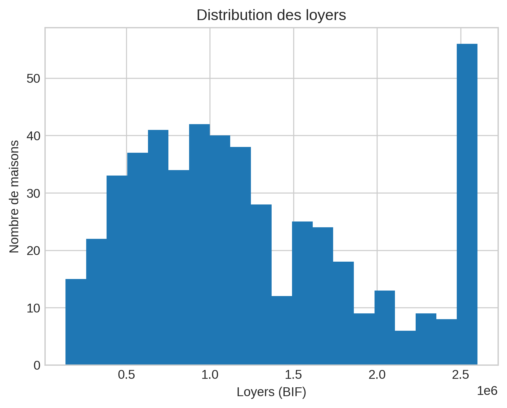

# 🏠 Prédiction de Loyers & 👥 Satisfaction des Employés — Projet Machine Learning

## 🧾 Vue d'ensemble du projet

Ce projet a été réalisé dans le cadre d'un parcours d'apprentissage en **Machine Learning** et a pour objectif de mettre en pratique l'ensemble du workflow de développement d'un modèle prédictif avec Python et Scikit-Learn.

Deux problématiques complémentaires sont étudiées :

- **Régression** : prédire le loyer mensuel d'une maison à partir de ses caractéristiques (superficie, quartier, nombre de chambres, équipements, etc.).
- **Classification** : prédire si un employé est satisfait ou non de son travail en fonction de ses caractéristiques professionnelles.

Le projet couvre toutes les étapes d'un pipeline de Data Science, depuis le nettoyage des données jusqu'à l'évaluation et la sauvegarde des modèles entraînés.

---

# 🎯 Objectifs

Les principaux objectifs sont :

- Comprendre le workflow complet d'un projet Machine Learning.
- Manipuler efficacement les tableaux NumPy.
- Nettoyer et préparer des données avec Pandas.
- Réaliser une analyse exploratoire (EDA).
- Construire des visualisations pertinentes avec Matplotlib et Seaborn.
- Encoder les variables catégorielles.
- Construire un modèle de régression avec **Linear Regression**.
- Construire des modèles de classification avec **Logistic Regression** et **Decision Tree**.
- Évaluer les performances des modèles à l'aide des métriques adaptées.
- Sauvegarder les modèles entraînés afin de pouvoir les réutiliser.

---

# 📁 Structure du dépôt

```text
AI-Engineering-Bootcamp/
│
├── data/
│   ├── rent_prediction.csv
│   └── employee_satisfaction.csv
│
├── notebooks/
│   ├── 01_numpy.ipynb
│   ├── 02_pandas.ipynb
│   ├── 03_data_exploration.ipynb
│   ├── 04_visualization.ipynb
│   ├── 05_regression.ipynb
│   └── 06_classification.ipynb
│
├── images/
│   ├── correlation_matrix.png
│   ├── rent_distribution.png
│   ├── boxplot_absences.png
│   ├── confusion_matrix_logistic.png
│   └── confusion_matrix_tree.png
│
├── models/
│   ├── linear_regression_model.pkl
│   └── employee_classifier.pkl
│
├── requirements.txt
└── README.md
```

---

# ⚙️ Installation

Clonez le dépôt :

```bash
git clone https://github.com/votre-utilisateur/AI-Engineering-Bootcamp.git
```

Accédez au dossier :

```bash
cd AI-Engineering-Bootcamp
```

Créer un environnement virtuel (optionnel mais recommandé) :

```bash
python -m venv .venv
```

Activer l'environnement :

### Linux / macOS

```bash
source .venv/bin/activate
```

### Windows

```bash
.venv\Scripts\activate
```

Installer les dépendances :

```bash
pip install -r requirements.txt
```

---

# 📦 Bibliothèques requises

Le projet repose principalement sur les bibliothèques suivantes :

| Bibliothèque | Utilisation |
|--------------|-------------|
| NumPy | Calcul scientifique |
| Pandas | Manipulation des données |
| Matplotlib | Visualisation |
| Seaborn | Visualisations statistiques |
| Scikit-Learn | Machine Learning |
| Joblib | Sauvegarde des modèles |
| Jupyter Notebook | Développement interactif |

Versions recommandées :

```text
numpy >= 2.0
pandas >= 2.3
matplotlib >= 3.10
seaborn >= 0.13
scikit-learn >= 1.7
joblib >= 1.5
```

---

# 🗂️ Description des données

## 🏠 Dataset : Rent Prediction

Objectif :

Prédire le **loyer mensuel d'une maison**.

Caractéristiques :

- 510 observations
- 12 variables

Variable cible :

- `LoyerMensuel_BIF`

Variables explicatives :

- Chambres
- Salon
- Salle de bain
- Parking
- Jardin
- Meublé
- Superficie
- Distance à la route
- Quartier
- Âge de la maison

---

## 👥 Dataset : Employee Satisfaction

Objectif :

Prédire si un employé est satisfait.

Caractéristiques :

- 238 observations
- 17 variables

Variable cible :

- `Satisfait`

Variables explicatives :

- Âge
- Sexe
- Département
- Niveau d'études
- Salaire
- Télétravail
- Heures supplémentaires
- Promotions
- Performance
- Ancienneté
- etc.

---

# 🔢 Exercices NumPy

Le notebook **01_numpy.ipynb** couvre les fondamentaux de NumPy :

- création de tableaux
- indexation
- slicing
- statistiques descriptives
- opérations vectorisées
- calcul de probabilités
- standardisation (Z-score)
- manipulation de matrices

Notebook :

```text
notebooks/01_numpy.ipynb
```

---

# 🐼 Exercices Pandas

Le notebook **02_pandas.ipynb** traite :

- lecture des fichiers CSV
- inspection des données
- suppression des doublons
- gestion des valeurs manquantes
- filtrage
- création de nouvelles variables
- statistiques descriptives
- export des jeux de données nettoyés

Notebook :

```text
notebooks/02_pandas.ipynb
```

---

# 🔍 Exploration des données

L'analyse exploratoire a permis de mieux comprendre les deux jeux de données.

Quelques observations importantes :

- Les maisons les plus grandes présentent généralement des loyers plus élevés.
- Certains quartiers affichent des niveaux de loyers significativement supérieurs aux autres.
- Les employés satisfaits présentent en moyenne moins d'heures supplémentaires et moins d'absences.
- La satisfaction semble également influencée par le salaire et l'équilibre entre vie professionnelle et vie privée.

Notebook :

```text
notebooks/03_data_exploration.ipynb
```

---

# 📈 Visualisations Matplotlib

Quelques graphiques réalisés :

## Corrélation entre les variables

```markdown

```

Cette matrice permet d'identifier les variables les plus corrélées avec le loyer ou la satisfaction.

---

## Distribution des loyers

```markdown

```

Elle montre la répartition des loyers et permet d'identifier d'éventuelles valeurs extrêmes.

---

## Absences selon la satisfaction

```markdown

```

Les employés satisfaits présentent généralement moins d'absences.

---

# 🏠 Modèle de régression

Modèle utilisé :

- Linear Regression

Prétraitements :

- traitement des valeurs manquantes
- One-Hot Encoding des variables catégorielles
- suppression de l'identifiant

Variables retenues :

- Chambres
- Superficie
- DistanceRoute
- Quartier
- Jardin
- Parking
- Meublé
- Salle de bain
- Âge de la maison

Métriques évaluées :

- MAE
- MSE
- RMSE
- R²

Le modèle final est sauvegardé dans :

```text
models/linear_regression_model.pkl
```

---

# 👥 Modèle de classification

Deux modèles ont été comparés :

- Logistic Regression
- Decision Tree Classifier

Prétraitements :

- Encodage ordinal
- Encodage binaire
- One-Hot Encoding
- Stratification des données

Métriques calculées :

- Accuracy
- Precision
- Recall
- F1-score
- Matrice de confusion
- Classification Report

Le modèle présentant le meilleur compromis entre précision et rappel (F1-score) est sauvegardé dans :

```text
models/employee_classifier.pkl
```

---

# 📊 Résultats

| Tâche | Modèle | Métriques |
|--------|---------|-----------|
| Régression | Linear Regression | MAE, MSE, RMSE, R² |
| Classification | Logistic Regression | Accuracy, Precision, Recall, F1 |
| Classification | Decision Tree | Accuracy, Precision, Recall, F1 |

Les résultats montrent que :

- la régression linéaire fournit une estimation satisfaisante des loyers lorsque les variables explicatives sont correctement préparées ;
- pour la classification, le choix du meilleur modèle repose principalement sur le **F1-score**, particulièrement pertinent en cas de déséquilibre des classes.

---

# 💡 Leçons apprises

Ce projet m'a permis de renforcer mes compétences en :

- NumPy
- Pandas
- Nettoyage des données
- Analyse exploratoire
- Visualisation de données
- Prétraitement des variables
- Construction de pipelines Scikit-Learn
- Régression
- Classification
- Évaluation des modèles
- Sauvegarde et réutilisation de modèles Machine Learning

J'ai également appris l'importance d'un prétraitement rigoureux des données avant l'entraînement d'un modèle.

---

# 🧗 Défis rencontrés

Les principaux défis rencontrés étaient :

- gestion des valeurs manquantes ;
- choix de la méthode d'encodage adaptée selon le type de variable ;
- sélection des variables les plus pertinentes ;
- interprétation correcte des métriques de performance ;
- comparaison objective de plusieurs modèles de classification.

Ces difficultés ont été surmontées grâce à l'analyse exploratoire, aux pipelines Scikit-Learn et à l'utilisation de métriques adaptées à chaque problème.

---

# 📚 Ressources

- Documentation officielle NumPy
- Documentation officielle Pandas
- Documentation officielle Matplotlib
- Documentation officielle Seaborn
- Documentation officielle Scikit-Learn
- Documentation Joblib

---

# ✍️ Auteur

**Dorian Axel DUSHIME**

- GitHub : https://github.com/baller72
- LinkedIn : https://linkedin.com/in/votre-profil